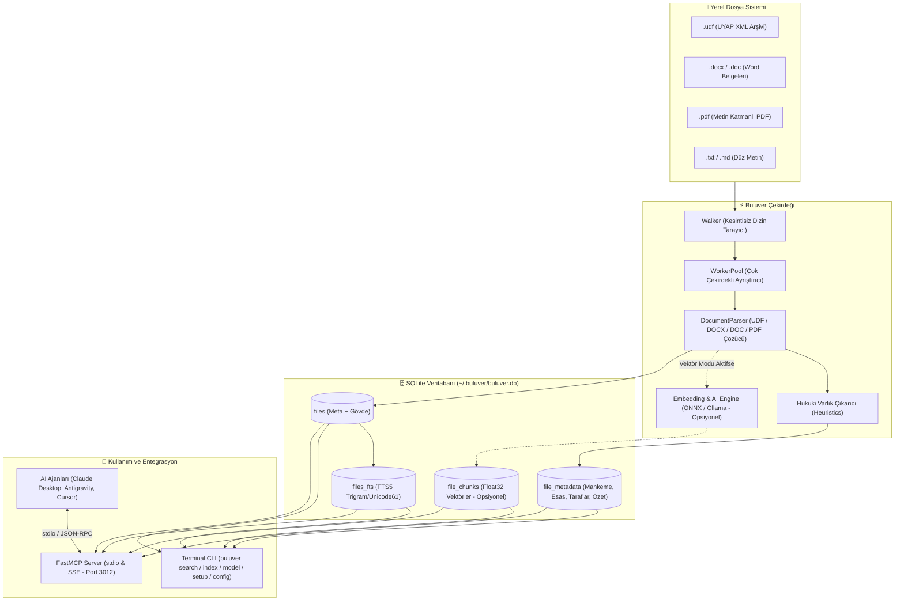

# Buluver ⚖️🔍

> **Sıfırdan Yazmaya Son: AI Ajanları İçin Avukatın Geçmiş Belgelerinden İlham Alma, Yazı Dilini / Üslubunu Benimseme ve Yerel Hukuk Arşivi (UDF, DOCX, DOC, PDF) Arama Motoru**  
> *Mitigate writing from scratch: Empower AI agents to draw inspiration from the lawyer's authentic pre-written documents, adopting their real voice, tone, and legal craft via FastMCP and CLI.*

[](https://nodejs.org)
[](https://github.com/punkpeye/fastmcp)
[](LICENSE)
[]()

---

## 📖 Temel Amaç ve Felsefe (Philosophy & Mission)

AI asistanları hukuki dilekçe, sözleşme veya mütalaa kaleme alırken çoğunlukla **sıfırdan (from scratch)** genel geçer, basmakalıp ve yapay bir dil üretir. 

**Buluver'in temel amacı bu sorunu kökten çözmektir:**
Avukatın veya kullanıcının daha önce bizzat kaleme aldığı yüzlerce gerçek dilekçeyi, cevabı, ihtarnamayı ve emsal kararı (`.udf`, `.docx`, `.doc`, `.pdf`, `.txt`) yerel olarak tarar. AI ajanları yeni bir hukuki metin yazmadan önce Buluver aracılığıyla avukatın geçmiş çalışmalarına anında erişir:
* **İlham Almak (Inspiration):** Avukatın benzer uyuşmazlıklarda hangi hukuki mantığı, argüman örüntülerini ve Yargıtay içtihatlarını kullandığını görür.
* **Yazı Dili ve Üslubu Öğrenmek (Tone & Voice):** Avukatın cümle kurma biçimini, mahkeme hitaplarını, itiraz sertliğini ve netice-i talep formülasyonunu benimser.
* **Sıfırdan Yazmayı Engellemek (Mitigate Writing From Scratch):** Boş sayfadan başlamak yerine, avukatın yıllar içinde olgunlaşmış kendi birikimini referans alarak belgeyi üretir.

Electron gibi hantal masaüstü kabuklarından tamamen arındırılmıştır; doğrudan sisteminizin Node.js çalışma zamanı üzerinde çalışır, minimum bellek tüketir (~30–70 MB) ve AI ajanlarının (Claude Desktop, Antigravity, Cursor, Windsurf, Cline) doğrudan `stdio` üzerinden bağlanabileceği yerel bir araç ekosistemi sunar.

---

## 🏗️ Mimari (Architecture)



---

## 🚀 Temel Yetenekler

* **Esnek ve Opsiyonel Çalışma Modları (FTS / Vektör / Tam AI):**
  * **FTS-Only (Sıfır AI Bağımlılığı):** Hiçbir model indirmeden, disk ve bellek harcamadan saf SQLite FTS5 (BM25) ve Trigram ile on binlerce sayfayı anında tarar.
  * **Vektör Modu:** Küratörlü model kataloğundan (`minilm-l12`, `nomic-embed`, `bge-m3`, `multilingual-e5`) seçilen yerel modelle (ONNX veya Ollama) anlamsal arama yapar.
  * **Tam AI Modu:** Vektör aramasını yerel LLM (Ollama, OpenAI, Gemini) ile otomatik özet ve etiket üretimiyle taçlandırır.
* **Küratörlü Model Kataloğu & Kesintisiz Geçiş:**
  * Tek doğruluk kaynağı olarak belirlenen 4 dengeli model (`minilm-l12`, `nomic-embed`, `bge-m3`, `multilingual-e5`).
  * Model değiştiğinde eski vektörlerin uyumsuzluğunu otomatik algılayıp güvenli rebuild akışı çalıştırır.
* **Kapsamlı Format Desteği:**
  * **`.udf` (UYAP):** ZIP arşivinden XML CDATA bloklarını okur; bozuk veya uncompressed XML dosyaları için otomatik düz metin kurtarma mekanizmasına sahiptir.
  * **`.docx` (Microsoft Word):** `mammoth` motoruyla tabloları ve gövde metnini çözer.
  * **`.doc` (Word 97-2003 İkili Format):** `word-extractor` ile eski arşiv belgelerini ayrıştırır.
  * **`.pdf` (Adobe PDF):** `pdf-parse` ile çok sayfalı metin katmanlarını ayıklar.
  * **`.txt`, `.md`:** Düz metin dosyalarını UTF-8 olarak okur.
* **Otomatik Hukuki Varlık Çıkarımı (Heuristic Extraction):**
  * **Mahkeme ve Merci:** `... ASLİYE HUKUK MAHKEMESİNE`, `CUMHURİYET BAŞSAVCILIĞINA`, `İCRA DAİRESİ`, `KAYMAKAMLIĞINA` vb. yönelme ve yalın halleri otomatik yakalar.
  * **Esas / Karar / Soruşturma No:** `2024/3682 E.`, `2026/138 Sor.` vb. kalıpları eşler.
  * **Taraflar:** Davacı, Müşteki, Talepte Bulunan vs. Davalı, Sanık, Şüpheli.
  * **Belge Türü ve Konusu:** Dilekçe konusu veya dosya adından türetilen hukuki konu.
* **Hibrit Arama Motoru (Hybrid Search / Reciprocal Rank Fusion - RRF):**
  * **FTS5:** Türkçe `unicode61 remove_diacritics 2` sözcük çözümleyicisiyle anında ve tam metin araması.
  * **Trigram (Infix):** Kelime ortasından, plaka, esas no parçası arama desteği (örn: `gıtay`, `3682`).
  * **Vektör Benzerliği:** Seçili katalog modeli ile kosinüs benzerliği. (Vektör kapalıysa zarifçe FTS5'e düşer).
  * **RRF:** Anahtar kelime ve anlamsal benzerlik skorlarını dengeli biçimde harmanlar.
* **Sıfır C++ Bağımlılığı & Tembel Yükleme (Zero C++ Addons & Lazy Loading):**
  * Node 22+ yerleşik `node:sqlite` (`DatabaseSync`) motorunu kullanır.
  * ONNX transformer kütüphaneleri tembel yüklenerek CLI başlatma süresi **<25 ms** seviyesinde tutulur.
* **Bulut Placeholder Koruması (macOS `SF_DATALESS`):**
  * iCloud Drive, OneDrive Files On-Demand veya Google Drive yerel alanlarında yalnızca bulutta olan ve diskte yer kaplamayan dosyaların istemsizce indirilmesini engeller.
* **Çok Çekirdekli Paralel Ayrıştırma:**
  * `node:worker_threads` havuzu ile tüm CPU çekirdeklerini kullanarak binlerce dosyayı dakikalar içinde indeksler.

---

## 📦 Kurulum (Installation)

Node.js v22+ veya v26+ gereklidir:

```bash
# Projeyi klonlayın ve kurun
git clone https://github.com/muratcanaskin/buluver.git
cd buluver

npm install
npm run build
npm link
```

Global kurulum sonrasında sisteminizin her yerinden `buluver` komutunu doğrudan çağırabilirsiniz.

---

## 💻 CLI Kullanım Kılavuzu

### 1. Akıllı Kurulum ve Mod Seçimi (`setup`)

```bash
# Saf tam metin modu: Sıfır model indirme, sıfır AI yükü (ultra hızlı)
buluver setup --fts-only

# Vektör arama modu ile kurulum (varsayılan minilm-l12 veya seçilen model)
buluver setup --mode embeddings

# Belirli bir model ile kurulum
buluver setup --mode embeddings --model bge-m3

# Tam AI modu (Vektör + LLM özetleyici)
buluver setup --mode full
```

### 2. Model Kataloğu ve Yönetimi (`model`)

```bash
# Desteklenen küratörlü model kataloğunu listele
buluver model list

# Şu anda aktif modeli ve indeks uyumluluk durumunu gör
buluver model current

# Katalogdan yeni bir model seç (gerekirse mevcut indeksler otomatik baştan üretilir)
buluver model use bge-m3
buluver model use nomic-embed
buluver model use minilm-l12
```

### 3. Sistem Durumu ve Yapılandırma (`status` & `config`)

```bash
# Genel sistem ve indeks durumunu gör
buluver status

# Mevcut model, LLM, chunk ve depolama ayarlarını gör
buluver config

# Vektör embedding özelliğini aç veya kapat
buluver config embeddings off
buluver config embeddings on

# LLM özetleme ve etiketlemeyi aç veya kapat
buluver config llm-enable on

# Model seç (veya mevcut modeli gör)
buluver config model bge-m3

# LLM Sağlayıcısını Ayarla (Ollama / OpenAI / Gemini)
buluver config llm --provider ollama --model qwen2.5:3b --base-url http://localhost:11434
# OpenAI için:
# buluver config llm --provider openai --model gpt-4o-mini --api-key sk-proj-...
# Gemini için:
# buluver config llm --provider gemini --model gemini-1.5-flash --api-key AIzaSy...

# LLM bağlantısını sına
buluver test-llm

# Chunk boyutlarını yapılandır
buluver config chunking --size 800 --overlap 150 --rebuild

# Tüm belgelerin vektörlerini baştan hesapla
buluver reindex-embeddings
```

### 4. Klasör Yönetimi ve İndeksleme (`add`, `remove`, `folders`, `index`)

```bash
# Klasör ekle ve hemen indeksle
buluver add ~/Documents/Davalar --index

# İzlenen klasörleri listele
buluver folders

# Kayıtlı tüm klasörleri tara ve indeksle
buluver index

# Sadece tam metin (FTS5) indekslemesi yap (vektörleri atla, ultra hızlı)
buluver index --no-embeddings

# İndeksleme sırasında LLM ile Türkçe özet ve etiket üret
buluver index --ai

# Klasörü ve ilişkili kayıtları dizinden kaldır
buluver remove ~/Documents/Davalar
```

### 5. Arama (`search`)

```bash
# Hızlı anahtar kelime araması (FTS5 Boolean - Varsayılan)
buluver search "kıdem tazminatı"
buluver search "(temyiz OR istinaf) AND (miras OR alacak)"

# Hibrit arama (FTS5 + Vektör RRF)
buluver search "kıdem tazminatı fazla mesai" --mode hybrid

# Trigram / Parça araması (Kelime ortasından, plaka, esas no parçası arama)
buluver search "gıtay" --mode infix
buluver search "3682" --mode infix
buluver search "107/2" --mode infix

# Yalnızca anlamsal vektör araması
buluver search "işçinin haksız feshi durumunda hakları" --mode semantic

# Sonuçları JSON olarak al (otomasyonlar ve scriptler için)
buluver search "tahliye ihtarı" --limit 5 --json
```

### 6. Belge İnceleme (`read`)

```bash
# UDF, DOCX veya PDF belgesini ayrıştırıp metnini ve metadatasını ekrana dök
buluver read ./talep.udf
buluver read ./karar.docx
buluver read ./tutanak.pdf --meta-only
```

### 7. Canlı İzleme Modu (`watch`)

```bash
# Klasörleri izler; yeni eklenen/değişen belgeleri anında otomatik indeksler
buluver watch
```

---

## 🤖 AI Ajanları ile Kullanım (FastMCP Server)

Buluver, Model Context Protocol (MCP) standartlarını eksiksiz destekler. AI asistanınız yerel hukuk kütüphanenizi doğrudan sorgulayabilir, belgeleri okuyabilir ve yeni klasörler ekleyebilir.

### Claude Desktop Yapılandırması
`~/Library/Application Support/Claude/claude_desktop_config.json` (macOS) dosyasına ekleyin:

```json
{
  "mcpServers": {
    "buluver": {
      "command": "buluver",
      "args": ["mcp"]
    }
  }
}
```

### Antigravity / Cursor / Windsurf Yapılandırması
* **Command:** `buluver` (veya `node /tam/yol/buluver/dist/cli.js`)
* **Args:** `["mcp"]`
* **Transport:** `stdio`

### Uzak veya SSE İhtiyaçları İçin
```bash
buluver mcp --transport sse --port 3012
```

### 💡 Ajan Yeteneği Kurulumu (`buluver skill add`)
Buluver, AI kodlama asistanları ve otonom ajanlar için optimize edilmiş standart bir **Skill (`SKILL.md`)** tanımı içerir. Ajanların Buluver'i ne zaman ve nasıl çağıracağını otomatik keşfetmesi için yetenek dosyasını tek komutla kurabilirsiniz:

```bash
# Otomatik kurulum: Mevcut çalışma alanı (.agents/skills/buluver) veya global ajan dizini
buluver skill add

# Yalnızca global ajan dizinine (~/.gemini/antigravity-cli/skills/buluver) kur
buluver skill add --global

# Belirli bir hedef dizine kur
buluver skill add ./custom-agent-skills/

# Yetenek dosyasının (SKILL.md) içeriğini konsola dök
buluver skill add --print
```


---

## 🛠️ Sunulan MCP Araçları (Tools Reference)

| Araç Adı | Açıklama | Başlıca Parametreler |
| :--- | :--- | :--- |
| `search` | Hukuk belgeleri arasında FTS5 veya vektör/hibrit arama yapar. | `query` (string), `mode` (`keyword`/`semantic`/`hybrid`), `limit` (number) |
| `read_document` | `.udf`, `.docx`, `.pdf`, `.txt` dosyasını ayrıştırıp temiz metin ve hukuki metadatasını döner. | `filePath` (string) |
| `status` | İndeks durumu, toplam dosya, chunk sayısı ve konfigürasyonu döner. | *(Parametresiz)* |
| `get_config` | Aktif embedding modeli, chunklama boyutları ve LLM bağlantı bilgilerini döner. | *(Parametresiz)* |
| `set_config` | Model, chunk boyutu, LLM (Ollama/OpenAI/Gemini) ayarlarını günceller; istenirse vektörleri baştan üretir. | `embedding_model`, `chunk_size`, `chunk_overlap`, `rebuild_embeddings`, `llm_provider`, `llm_model`, `llm_base_url`, `llm_api_key` |
| `test_llm` | Yapılandırılmış LLM servisine bağlantıyı sına. | *(Parametresiz)* |
| `rebuild_embeddings` | Tüm indeksli belgelerin vektör embeddinglerini aktif model ve chunk ayarlarıyla baştan hesaplar. | *(Parametresiz)* |
| `add_folder` | Yeni bir klasörü dizine ekler ve isteğe bağlı olarak hemen indeksler. | `folderPath` (string), `scanNow` (boolean) |
| `remove_folder` | Klasörü ve o klasöre ait indekslenmiş belgeleri dizinden siler. | `folderPath` (string) |
| `trigger_scan` | Kayıtlı tüm klasörlerde tam indeksleme işlemini başlatır. | `withEmbeddings` (boolean) |
| `update_document_metadata` | Belgenin özet, etiket veya hukuki bilgilerini (mahkeme, esas no, davacı, davalı) el ile günceller. | `filePath`, `summary`, `tags`, `case_number`, `court_name`, `plaintiff`, `defendant` |

---

## 🗄️ Veri Güvenliği ve Yerellik İlkesi

* **100% Yerel Çalışma:** Hiçbir belge içeriği, dosya adı veya arama sorgusu dış sunuculara veya telemetri sistemlerine gönderilmez.
* **Veritabanı Konumu:** `~/.buluver/buluver.db` (Ortam değişkeni ile özelleştirilebilir: `BULUVER_DB_PATH`).
* **Model Önbelleği:** `~/.buluver/models` (ONNX modelleri yerel diskte önbelleğe alınır, internet erişimi yalnızca ilk model indirmesinde kullanılır).
* **Veri İzolasyonu:** Klasör kaldırıldığında (`buluver remove <klasör>`), o klasöre ait tüm metin, FTS kayıtları ve vektör chunk'ları SQLite veritabanından kalıcı olarak silinir.

---

## 📄 Lisans

MIT License © 2026 Murat Can Aşkın & Buluver Katkıda Bulunanları.
