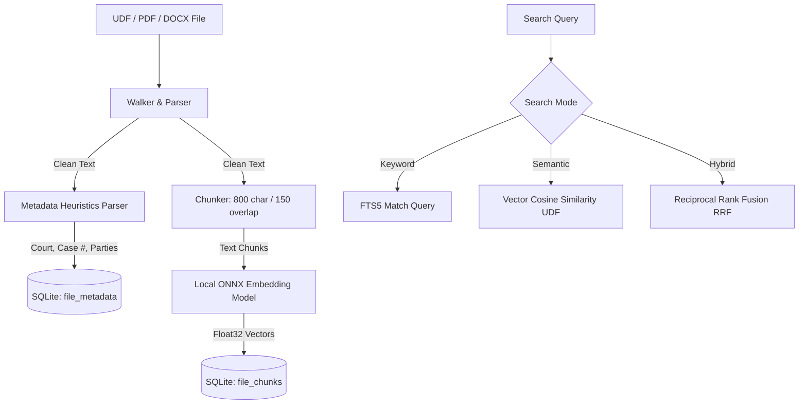

# Unified Implementation Plan: Case Metadata & Local Semantic Search (RAG)

This plan integrates the **UDF Case Metadata Tracking** and **Local Semantic Search** features into the İzBul Reborn desktop application.

---



---

## 1. Database Schema Extensions

We will modify [database.ts](file:///Users/muratcanaskin/coding/izbul/electron/services/database.ts) to establish the schemas and custom SQLite functions:

1. **Foreign Keys**: Ensure `PRAGMA foreign_keys = ON;` is executed on connection initialization.
2. **`file_metadata` Table**:
   ```sql
   CREATE TABLE IF NOT EXISTS file_metadata (
     file_id INTEGER PRIMARY KEY,
     summary TEXT,
     tags TEXT, -- JSON string array
     case_number TEXT,
     court_name TEXT,
     document_type TEXT,
     plaintiff TEXT,
     defendant TEXT,
     updated_at INTEGER NOT NULL,
     FOREIGN KEY (file_id) REFERENCES files (id) ON DELETE CASCADE
   );
   ```
3. **`file_chunks` Table**:
   ```sql
   CREATE TABLE IF NOT EXISTS file_chunks (
     id INTEGER PRIMARY KEY,
     file_id INTEGER NOT NULL,
     chunk_index INTEGER NOT NULL,
     text TEXT NOT NULL,
     embedding BLOB NOT NULL, -- Float32Array stored as binary blob
     FOREIGN KEY (file_id) REFERENCES files (id) ON DELETE CASCADE
   );
   CREATE INDEX IF NOT EXISTS idx_file_chunks_file_id ON file_chunks(file_id);
   ```
4. **Cosine Similarity UDF**: Register a custom function `cosine_similarity` in SQLite:
   ```typescript
   db.function('cosine_similarity', (emb1: Buffer, emb2: Buffer) => {
     const arr1 = new Float32Array(emb1.buffer, emb1.byteOffset, emb1.length / 4);
     const arr2 = new Float32Array(emb2.buffer, emb2.byteOffset, emb2.length / 4);
     let dotProduct = 0, normA = 0, normB = 0;
     for (let i = 0; i < arr1.length; i++) {
       dotProduct += arr1[i] * arr2[i];
       normA += arr1[i] * arr1[i];
       normB += arr2[i] * arr2[i];
     }
     if (normA === 0 || normB === 0) return 0;
     return dotProduct / (Math.sqrt(normA) * Math.sqrt(normB));
   });
   ```

---

## 2. Text Chunking & Local Embedding Generation

We will create a new helper service `EmbeddingService` ([embeddings.ts](file:///Users/muratcanaskin/coding/izbul/electron/services/embeddings.ts)):

1. **Model**: Use `@xenova/transformers` (or `@huggingface/transformers`) running the `Xenova/paraphrase-multilingual-MiniLM-L12-v2` model (highly effective for Turkish text and lightweight, ~45MB footprint).
2. **Dynamic Loading & Progress**:
   - The pipeline is loaded dynamically when first needed (e.g., during indexing or the first search).
   - Use `progress_callback` from the pipeline to capture download statuses and broadcast them to the React UI via IPC (`embedding-model-progress`).
   - Cache model files in the Electron application's `userData` folder.
3. **Text Chunker**:
   - Chunk size: `800` characters.
   - Chunk overlap: `150` characters.
   - Clean whitespace and format layout elements.
4. **Vector Serialization**: Converts the generated embeddings (`Float32Array`) into `Buffer` instances before insertion into SQLite.

---

## 3. Metadata Extraction Heuristics

We will write `extractMetadataHeuristics` inside [udf-parser.ts](file:///Users/muratcanaskin/coding/izbul/electron/services/udf-parser.ts):

- **Court Name**: Extracts leading sentences containing Turkish court suffixes (`MAHKEMESİ`, `HAKİMLİĞİ`, `BAŞKANLIĞI`, `İCRA DAİRESİ`).
- **Case/Esas Number**: Uses regular expressions to match patterns such as `ESAS NO\s*:\s*(\d+/\d+)` or `DOSYA NO\s*:\s*(\d+/\d+)`.
- **Parties (Plaintiff / Defendant)**: Matches prefix patterns like `DAVACI\s*:\s*([^\n]+)` and `DAVALI\s*:\s*([^\n]+)`.
- **Document Type**: Pulls from subjects (`KONU\s*:\s*([^\n]+)`) or defaults to the filename.

---

## 4. Indexer & Worker Integration

We will modify [indexer.ts](file:///Users/muratcanaskin/coding/izbul/electron/services/indexer.ts) and [indexWorker.ts](file:///Users/muratcanaskin/coding/izbul/electron/services/indexWorker.ts):

1. **Worker Threads**:
   - Extract text content from documents.
2. **Main Thread Post-Processing**:
   - For UDF files, apply the `extractMetadataHeuristics` to parse fields and insert them into the `file_metadata` table inside the indexing batch transaction.
   - Generate overlapping chunks of text, create embeddings via `EmbeddingService`, and bulk write the chunks to the `file_chunks` table.

---

## 5. Hybrid Search & RRF Merging

Implement a hybrid search algorithm in `DatabaseService` ([database.ts](file:///Users/muratcanaskin/coding/izbul/electron/services/database.ts)):

1. **FTS Keyword Query**: Execute the MATCH search against `files_fts` and rank results.
2. **Semantic Vector Query**: Convert query string to embedding vector, query chunks via `cosine_similarity(embedding, ?)`, and rank documents.
3. **Reciprocal Rank Fusion (RRF)**:
   - Assign RRF scores to each document matching either query:
     $$RRF(d) = \frac{1}{60 + Rank_{FTS}(d)} + \frac{1}{60 + Rank_{Semantic}(d)}$$
   - Sort descending by RRF score. Return merged items featuring matching snippets and metadata annotations.

---

## 6. Exposing Capabilities: FastMCP & React UI

### FastMCP Server ([mcp.ts](file:///Users/muratcanaskin/coding/izbul/electron/services/mcp.ts))
- **`search_index`**: Extend parameters with `mode` (`'keyword' | 'semantic' | 'hybrid'`, defaulting to `'hybrid'`) and return merged matches including chunk snippets and metadata fields.
- **`update_udf_metadata`**: Register a tool allowing manual override of tags, summaries, or legal attributes.

### IPC Handlers ([main.ts](file:///Users/muratcanaskin/coding/izbul/electron/main.ts))
- `search`: Accepting `{ query, mode }`.
- `get-model-status`: Returns current download/loading status of the embedding model.
- `update-metadata`: For manual edits.

### React UI ([App.tsx](file:///Users/muratcanaskin/coding/izbul/src/App.tsx))
- **Model Downloader Modal**: A clean overlay showing downloading progress if the embedding model is being fetched on the first run.
- **Search Mode Toggles**: Buttons (Keyword / Semantic / Hybrid) placed next to the search input.
- **Metadata Cards**: Show extracted case information, tags, and summary alongside search result snippets.

